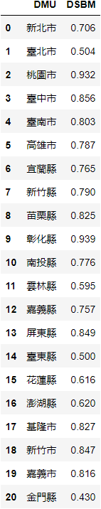
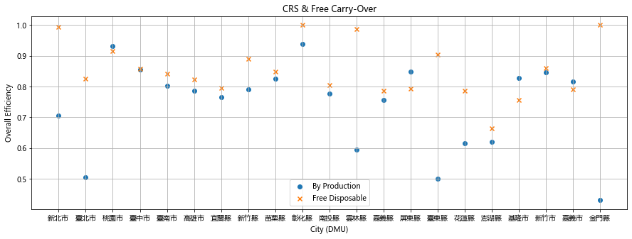
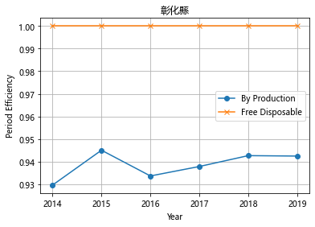
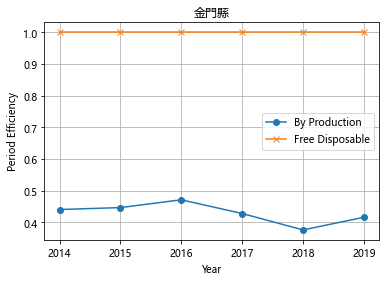
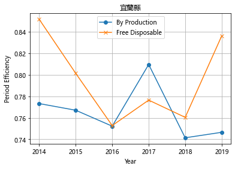
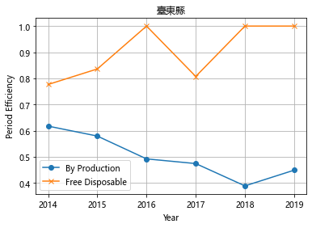
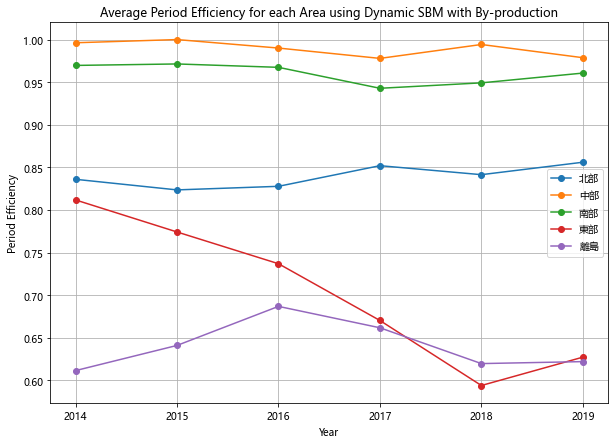

# Dynamic-SBM-by-production-technologies

## 1 Background and Motivation
### 1.1 Background
With the rapid development of Taiwan, the demand for energy, such as electricity, power, etc., has also increased. Nonetheless, one of the by-products of using energy is the trash. When the amount of trash is disposed of, there will be more pollution in the atmosphere and soil, causing environmental damage. Since the world aims at zero pollution, Taiwan, as one of the most sustainable countries, has noticed the severity of pollutants and has started to consider this environmental issue.

In Taiwan, the government will not only deal with environmental problems, but also deal with economic problems. The authorities have the responsibility to help each city in Taiwan address these problems. Therefore, the government has to know the overall conditions of each city, including GDP, the amount of labor and trash, and so on. By doing this, the authorities could help improve the cities. The government could know the performance of the cities by using dynamic SBM: by-production technologies, the overall efficiency and dynamic change in the efficiency of the period of cities in Taiwan from 2014 to 2019.

### 1.2 Motivation
Because dynamic SBM: by-production technologies could improve the accuracy of efficiency measurement and solved the problem of not containing slack variables when measuring the inefficiency rate of traditional radial models [[1]](#1). Therefore, we hope this research can give a good estimation of overall and period efficiency of cities, and can also give an insight to find the efficiency change of each city over the entire observed period. Especially, we would like to provide the efficiency analysis for **human resources department** which we regard it as the most important decision-making unit in the government based on the population in all province levels. 

### 1.3 Paper Reproduction
Tone, K., & Tsutsui, M., 2014. Dynamic DEA with network structure: A slacks-based measure approach. Omega, 42(1), 124-131.

### 1.4 Problem Definition
We would like to calculate the overall and period efficiency of each city in Taiwan from 2014 to 2019. Traditinal methods only calculate the overall efficiency with free disposable input. To measure the efficiency accurately, we use dynamic SBM with by-product technologies to justify the result.


## 2 Methodology
Based on Dynamic DEA: A slack-based measure approach published by Tone and tsutsui [[3]](#3), we first construct a model according to the paper, and then deal with bad output by by-production method instead of considering it as free disposable inputs.
we also try to calculate Malmquist-Luenberger Index to find out the efficiency change through the periods.


### 2.1 Dynamic SBM: consider bad output as free disposable input
#### Indices
$X^{tN}_{ki}$: the non-pollution-causing input  
$X^{tN}_{ki}$: the pollution-causing input  
: the good output  
: the bad output  
: the firm

#### Sets
: Input,   
: Output,   
: Pollutants,   
: States in US, 

#### Parameters
: ith input of firm k  
: jth good output of firm k  
: qth bad output of firm k

 : direction of jth good output  
 : direction of qth bad output

#### Decision Variables

 : intensity weights representing the convex combination between firms  
 : intensity weights representing the convex combination between firms  
 : efficiency  

#### DDF Model

Below is a general form of DDF in the paper.  
We called the constraint(1)(2) **Input Constraint**, and (1) use the X we want to consider in the model. The same as the following constraints, so constraint(3)(4) are **Desirable Output Constraint**, and constraint(5)(6) are **Undesirable Output Constraint**. Constraint(1)(3)(5) are the X,Y,B we want to consider, on the contrary, constraint(2)(4)(6) are those we don't sonsider in the model. The last constraint (7) is the **Convex-Combination Constraint**.

Take a look at the  and  in the constraint (3) and (5). They mean the direction that raw data will project to, and we can see that the efficiency is plused in Y and minused in B. For the opposite direction, it is because the undesirable output is a by-product of desirable output, and we want the desirable output higher while the undesirable output could be lower. But notice that the relation between desirable output and undesirable output is not trade-off. In fact, when we increase the desirable output, the undesirable output will increase simultaneously.

  

In this study, we want to focus on one input (Coal), one output (Electricity), and three bad outputs(CO<sub>2</sub>,SO<sub>2</sub>,NO<sub>x</sub>) here, so we can simplify the model as:


#### Source Code(python-pulp)

We use python with PuLP to implement the model.  
**Xr**, **Yr** and **Br** are in respect of a state's **coal comsumption**, amount of **electricity productivity** and amount of **pollutant emission**. The other 2 parameters, **gY** and **gB**, represent the direction we want to project.

```python
def DDF(Xr, Yr, Br, gY, gB):
    # Decision variables
    Eff = LpVariable('eff', lowBound=None, upBound=None, cat='Continuous')
    Lambda = LpVariable.dicts('lambda', (K), lowBound=0, upBound=None, cat='Continuous')
    Mu = LpVariable.dicts('mu', (K), lowBound=0, upBound=None, cat='Continuous')

    DDF = LpProblem('DDF_model', LpMaximize)
    
    # Objective function
    DDF += Eff

    # Constraints
    DDF += lpSum((Lambda[k]+Mu[k])*X[k] for k in K) <= Xr # I Constraint
    DDF += lpSum(Lambda[k]*Y[k] for k in K) >= Yr + Eff*gY # GO Constraint
    for q in Q:
        modDDFel1 += lpSum(Lambda[k]*B[k,q] for k in K) <= Br[q] - Eff*gB[q] # BO Constraint
    DDF += lpSum(Lambda[k]+Mu[k] for k in K) == 1 # Convex
    
    DDF.solve()
    return (value(DDF.objective))
```

With the efficiency , we can project raw data to the frontier line. That is, the frontier data will be , which is the projection of raw data  to the frontier line.

<a id="2.2"></a> 
### 2.2 Dynamic SBM: by-production technologies


### 2.3 Malmquist-Luenberger Index
When the DMU data is panel data containing multiple time points, the Malmquist total factor productivity index should be used to analyze efficiency change. Chung et al. [[2]](#2) proposed the Malmquist-Luenberger Index (ML index) based on the Malmquist model by applying a DDF containing the undesirable output. Any Malmquist index with undesirable output is called the ML productivity index [[1]](#1). Based on the method proposed by Chung et al. [[2]](#2), Li et al. [[1]](#1) proposed ML equation, combining the SBM model with undesirable output. Since their ML equation combining SBM model with undesirable output corresponds to our Dynamic SBM: by-production technologies [[2.2]](#2.2), we used their ML equation to implement Malquist-Luenberger Index. Its fixed ML index equation constructed in this paper is as follows: the common reference set of each period is $S_f = {(x^f_j, y^f_j, b^f_j)}$ , and $f$ is the number of 1 ~ period $p$. A single ML index is calculated. $ML^f_0 ( x^{t+1}_0 ,  y^{t+1}_0,  b^{t+1}_0,  x^t_0,  y^t_0,  b^t_0)  =  E^f_0 ( x^{t+1}_0 ,  y^{t+1}_0,  b^{t+1}_0 ) / E^f_0 ( x^t_0 ,  y^t_0,  b^t_0 )$. 

The efficiency change of $DMU_0$ from $t$ to $t+1$ period is represented by $ML^f_0 ( x^{t+1}_0 ,  y^{t+1}_0,  b^{t+1}_0,  x^t_0,  y^t_0,  b^t_0)$. Among them, $E^f_0 ( x^t_0 ,  y^t_0,  b^t_0 )$ and $E^f_0 ( x^{t+1}_0 ,  y^{t+1}_0,  b^{t+1}_0 )$ represent the efficiency values of $DMU_0$ in $t$ period and $t+1$ period. $ML^f_0 ( x^{t+1}_0 ,  y^{t+1}_0,  b^{t+1}_0,  x^t_0,  y^t_0,  b^t_0) = 1$ indicates that efficiency remains unchanged, $ML^f_0 ( x^{t+1}_0 ,  y^{t+1}_0,  b^{t+1}_0,  x^t_0,  y^t_0,  b^t_0) > 1$ indicates that efficiency increases, and $ML^f_0 ( x^{t+1}_0 ,  y^{t+1}_0,  b^{t+1}_0,  x^t_0,  y^t_0,  b^t_0)< 1$ indicates that efficiency decreases. [[1]](#1)

However, since we cannot solve the infeasible problems of Malmquist-Luenberger Index, the results of the efficiency change from Malmquist-Luenberger Index will not be shown in the next section.


## 3 Data Collection and Analysis Result
This section will explain how the data we used were collected and the columns of the data. The following is the analysis results of comparison between by-production and free-disposable input.  

### 3.1 Data Collection
Our dataset includes five kinds of data: non pollution input-tax revenue (million), population (people), desirable output-GDP (million), undesirable output-trash (ton), and free/fixed link-labor (thousand people). Each city in Taiwan has the data from 2014 to 2019. The data of tax revenue, trash, population, and labor were obtained by [national statistics](https://winsta.dgbas.gov.tw/DgbasWeb/ZWeb/StateFile_ZWeb.aspx). The amount of GDP were multiplied GDP person by the number of population in cities. For the GDP per person, we first gained GDP per person from 2014 to 2019 from [national statistics](https://winsta.dgbas.gov.tw/DgbasWeb/ZWeb/StateFile_ZWeb.aspx), and then multiplied the number of population by GDP per person to get GDP of each city.

### 3.2 Result of by-production DSBM
After formulating our dynamic sbm with by-production technology, we get the overall efficiency of each city. According to the result, the most efficient city is 彰化, and we might infer that because recently, 彰化 has been going on large-scale constructions, and its housing price has been sky-rocketing, so the efficiency would be high. On the other hand, the most inefficient city is 金門, and we might infer that it is because the economy of 金門 has been relying on tourism industry, and the tourists are not improving, so the efficiency would be low. Also, one of the special results we get is 台北, because in common, we might consider Taipei as efficient for the reason that it is the capital of Taiwan. However, it might be because the space is not enough and pollution is high, so all in all it’s not a good circumstances for 台北 to develop its economy, and it is because Taipei is the capital, so it must be full of laborers, thus, the efficiency might be lower than expected. Viewing the abnormal result, the government could pay more attention to the efficiency of Taipei.

Below is the result of dynamice SBM with by-production technology.



### 3.3 Comparison between by-production and free disposable input
We had also formulated the original dynamic sbm, which considers bad output as free disposable. The chart is about the comparison of our by-production and the free disposable method, the x coordinate is each DMU, and the y coordinate is the overall efficiency. Most of the cities get lower overall efficiency by our method, which shows our model can get a more precise estimation of the efficiency, and the variance of each city is shown more clearly by our method, also. Thus, we can differentiate efficient cites from inefficiency cities.



After estimating the overall efficiency of each city, we had also derived deeper into the efficiency of each city in each year, to get more insight, and we had selected four cities as examples. 

The two of them are 彰化 and 金門. In the free disposable method, the result might lead to the conclusion that they are both efficient, and we can hardly see the increase or decrease from year to year. On the other hand, using the by-production model, we can see that actually, 彰化 is more efficient than 金門, and 彰化 is the most efficient one and 金門 is the most inefficient one according to the overall efficiency. Also, according to the result we get from our by-production model, we can actually show the change in efficiency in each year, to help further analysis for the government. However, if we consider the original free-disposable method, we could only infer that the two cities are both efficient in each year.




The next two of the examples are 宜蘭 and 臺東. In 宜蘭, we can see that in 2017, it had a peak, and by our model, we can more clearly observer that, and the peak according to the raw data, although the gdp were not severely changed, but the tax had decreased, so it would show as a peak. In 臺東, we can see that by our model, it kept decreasing its efficiency, it can a good warning for 台東 to show that the efficiency of it has been actually decreasing, and it might work hard to come out with a solution to deal with it.




### 3.4 Comparison between each area

Although we had get the data and result of each city, the input or output, etc, could not easily be divided into cities in the real world. The cities in the same area might interfere with each others. Thus, we also experiment on the average period efficiency of each period. According to the result, 中部 and 南部 are the most efficient, for the reason that they are still developing rapidly. Also, 離島 and 東部 are the most inefficient, for the reason that the mostly depend on the tourism industry. Last, 北部 falls in the middle.




## 4 Conclusion
In conclusion, We used dynamic SBM to analyze the efficiency of each period. Compared with free-disposable inputs, we used by-production technologies to know more about the difference of efficiency between periods and DMUs. Next, we combined the advantages of the two and proposed dynamic SBM and by-production. With this method, we analyzed the efficiency of each city in Taiwan from 2014 to 2019. The results show the trend of efficiency over the periods. Take Changhua as an example. eg: even though Changhua’s overall efficiency is high, its trend can show Changhua regresses in some periods. In addition, the results show Taipei is not as efficient as we expected, Changhua outperforms other cities, and Taitung & Kinmen fall behind. The government can take these results into consideration. Finally, we hope the human resources department of Taiwanese government can use the efficiency analysis we proposed to help the cities improve, and in the long term, Taiwan can get better than before. 
 


## Reference
### Data
[National statistics](https://statdb.dgbas.gov.tw/pxweb/dialog/CityItemlist_n.asp)

### Paper
<a id="1">[1]</a> 
Li, Y., & Chen, Y. (2021). Development of an SBM-ML model for the measurement of green total factor productivity: The case of pearl river delta urban agglomeration. Renewable and Sustainable Energy Reviews, 145, 111131. <br>
<a id="2">[2]</a> 
Chung, Y. H., Färe, R., & Grosskopf, S. (1997). Productivity and undesirable outputs: a directional distance function approach. journal of Environmental Management, 51(3), 229-240. <br>
<a id="3">[3]</a> 
Tone, K., Tsutsui, M., 2010. Dynamic DEA: A slack-based measure approach. Omega: Int. J. Manage. Sci. 38, 45–156.
